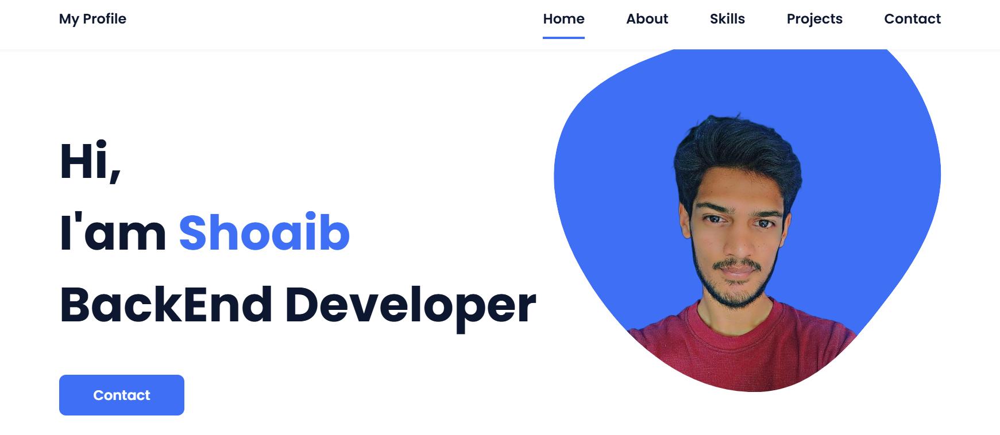
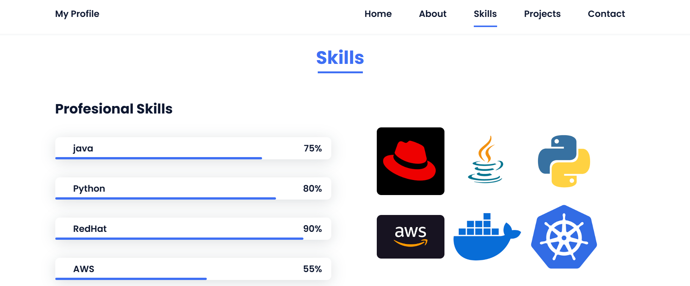
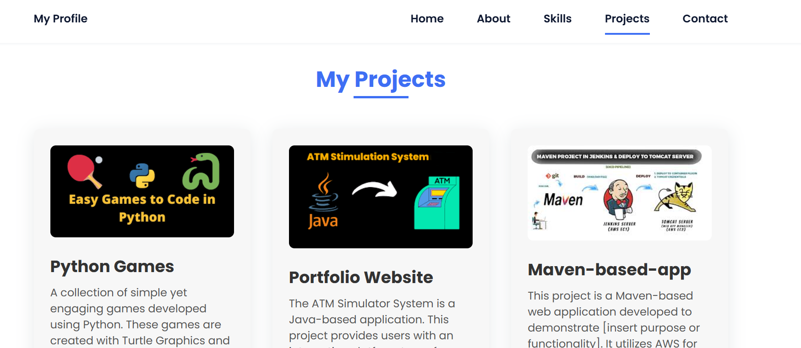

# Portfolio Website


## Overview

This Portfolio Website is a personal project designed to showcase my skills, projects, and professional experience. It serves as an online resume and portfolio, providing visitors with an insight into my work and background.





## Features

- **Responsive Design**: Ensures optimal viewing experience across various devices.
- **Project Showcase**: Highlights selected projects with descriptions and links.
- **About Me Section**: Provides a brief introduction and background information.
- **Contact Form**: Allows visitors to get in touch directly through the website.
- **Blog Section**: (Optional) Shares articles and insights related to my field.

## Technologies Used

- **Frontend**: HTML, CSS, JavaScript
- **Frameworks**: Bootstrap (if applicable)
- **Animations**: CSS Animations, AOS Library (if applicable)
- **Hosting**: GitHub Pages (or specify your hosting platform)

## Getting Started

### Prerequisites

- Web browser (e.g., Chrome, Firefox)
- Code editor (e.g., VSCode, Sublime Text)

### Installation

1. **Clone the Repository**:

   ```bash
   git clone https://github.com/SHAIKSHOAIB-GIT/Portfolio-WebSite.git
   cd Portfolio-WebSite
